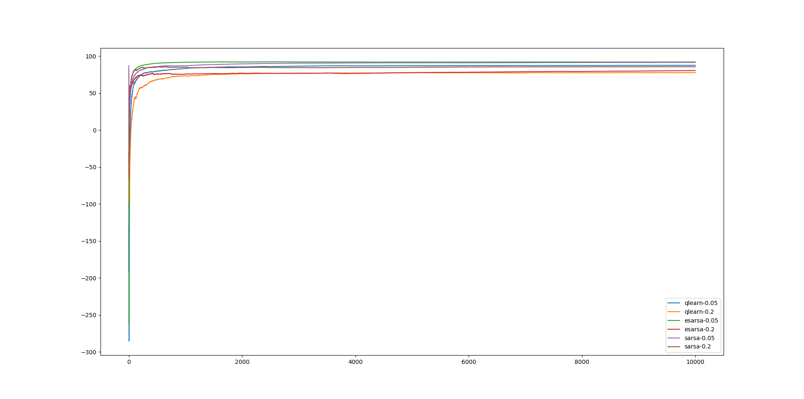
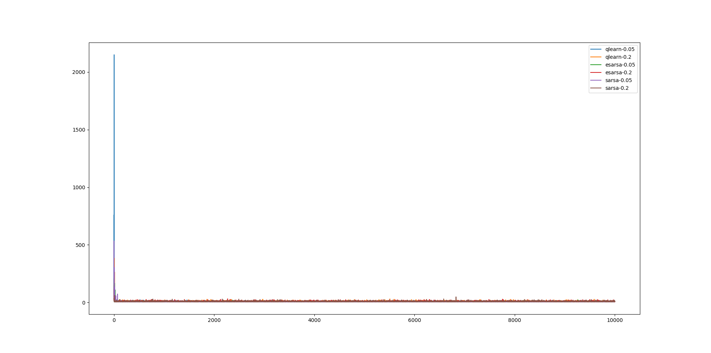

Topics in Machine Learning
===

* Jerin Philip [`<jerin.philip@research.iiit.ac.in`](mailto:jerin.philip@research.iiit.ac.in)
* 201401071

# Graphs

For more clearer images, please look in directory `exps` in the submission.

## Mean Rewards vs Episodes



## Steps to goal vs Episodes




# Impacts of Epsilon on Convergence

With a greater epsilon, the algorithm reaches a stable value faster, but in the
long run, a smaller epsilon seems to be better in the long run.

For a given algorithm, hence the mean reward seems to be lesser for larger
epsilon at the end of 10,000 episodes.

# Optimal Policies and Values

 * Arrows indicate the direction in the gridworld to head to.
 * Tables contain the value function for the respective experiment.

## Q-Learning

### qlearn-0.05

```
>vvv
>>>v
^>vv
^>>v
```

|   | 1     | 2     | 3      | 4      |
|-- | ----- | ----- | -----  | ------ |
| 1 | 88.73 | 92.31 | 94.66  | 96.12  |
| 2 | 90.85 | 94.77 | 96.83  | 98.83  |
| 3 | 42.92 | 96.15 | 98.83  | 100.84 |
| 4 | 11.17 | 92.49 | 100.84 | 0.85   |

### qlearn-0.2


```
>>vv
v>vv
vvvv
>>>v
```


|   | 1     | 2     | 3      | 4      |
|-- | ----- | ----- | -----  | ------ |
| 1 | 82.75 | 89.90 | 93.92  | 95.84  |
| 2 | 84.39 | 93.74 | 96.55  | 98.64  |
| 3 | 93.18 | 96.04 | 98.68  | 100.71 |
| 4 | 96.37 | 98.65 | 100.71 | 0.72   |

## Expected SARSA
### esarsa-0.05

```
>>vv
>>>v
^>>v
>>>^
```

|   | 1     | 2     | 3      | 4      |
|-- | ----- | ----- | -----  | ------ |
| 1 | 80.07 | 88.78 | 92.49  | 95.66  |
| 2 | 83.20 | 91.48 | 95.81  | 98.73  |
| 3 | 70.72 | 94.90 | 98.72  | 100.88 |
| 4 | 79.44 | 97.01 | 100.88 | 0.94   |

### esarsa-0.2

```
>>vv
>>>v
^>>v
>>>^
```

|   | 1     | 2     | 3      | 4      |
|-- | ----- | ----- | -----  | ------ |
| 1 | 80.07 | 88.78 | 92.49  | 95.66  |
| 2 | 83.20 | 91.48 | 95.81  | 98.73  |
| 3 | 70.72 | 94.90 | 98.72  | 100.88 |
| 4 | 79.44 | 97.01 | 100.88 | 0.94   |

## SARSA
### sarsa-0.05

```
>>vv
>>>v
^>>v
>>>^
```

|   | 1     | 2     | 3      | 4      |
|-- | ----- | ----- | -----  | ------ |
| 1 | 69.24 | 80.62 | 86.56  | 91.88  |
| 2 | 68.97 | 83.90 | 91.97  | 97.11  |
| 3 | 39.06 | 85.30 | 96.72  | 100.82 |
| 4 | 45.99 | 80.73 | 100.82 | 0.86   |

### sarsa-0.2

```
>>vv
>>>v
v>>v
>>>>
```

|   | 1     | 2     | 3      | 4      |
|-- | ----- | ----- | -----  | ------ |
| 1 | 48.77 | 62.00 | 72.89  | 84.48  |
| 2 | 50.02 | 72.74 | 84.57  | 93.61  |
| 3 | 45.78 | 76.85 | 93.65  | 100.67 |
| 4 | 67.37 | 91.43 | 100.66 | 0.79   |

